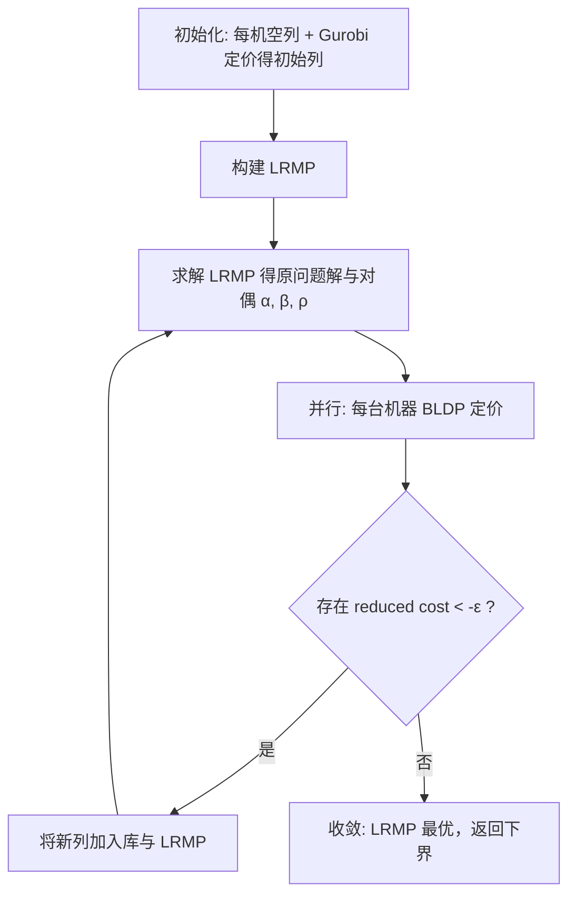

# 考虑时效限制与显式报废的配置相关装箱调度问题  
## 技术报告（问题背景 · 建模 · D-W 分解与列生成 · 算例生成）

> 项目代码仓库：`bin_packing_and_scheduling`  
> 参考文献基础：Hao et al. (2022), *European Journal of Operational Research* — 配置相关装箱与批量计划集成问题  
> 本文档描述**当前实现版本**（无装配工序、显式 WIP 报废、Dantzig-Wolfe 列生成）。

---

## 1. 问题背景

### 1.1 工业场景

某制造企业需要将多种 **WIP（待固化物料）** 放入工业 **热压罐（autoclave）** 完成固化。每种物料：

- 占用一定 **托盘长度**，若干物料装入同一热压罐时总长度不能超过罐体容量；
- 必须在特定 **固化配置（config）** 下加工，同一罐内同一时刻只能运行一种配置；
- 切换配置需要 **setup**，setup 后须连续运行该配置若干时段（配置相关加工时间）。

固化完成后，物料**直接作为最终产品**满足外部需求（本项目**已去除**原论文中的装配/BOM 工序）。

### 1.2 新增业务约束：时效与报废

实际生产中，WIP 具有 **保质期 / 时效窗口**：

- 每个物料 $i$ 有 **最晚进罐时段** $D_i$：只允许在 $t \le D_i$ 投入热压罐；
- 计划期初释放 $w_i$ 单位待固化 WIP，须在 $D_i$ 前 **全部进罐加工**，或 **显式报废**；
- 超期未进罐的 WIP 不能再用，须计入报废量 $R_i$。

成品侧允许 **延期交货（backorder）**，也可持有 **成品库存**；但 WIP 侧“未加工”与成品侧“未交货”是不同概念，需分别用 $R_i$ 与 $S_{it}^-$ 刻画。

### 1.3 问题归类

本问题可概括为：

> **带 WIP 时效限制与显式报废的配置相关装箱 + 多机调度 + 批量计划（lot-sizing）**

核心难点：

| 难点 | 说明 |
|------|------|
| 配置相关 setup | 热压罐可重配置，setup 与运行窗口耦合（$Y,Z$ 约束） |
| 一维装箱 | 同一 setup 内多种物料混装，受托盘长度与罐容量限制 |
| 时效 | 进罐截止 $D_i$，与产能、排程相互制约 |
| 物料守恒 | WIP 必须“进罐 + 报废”分摊，不可隐式消失 |
| 规模 | Set B：25 期 × 35 物料 × 7 机 × 10 配置，整数变量规模大 |

---

## 2. 集成模型（IM）建模

### 2.1 集合与索引

| 符号 | 含义 |
|------|------|
| $T=\{1,\ldots,T_{\max}\}$ | 离散计划时段 |
| $I$ | WIP / 最终产品集合 |
| $M$ | 热压罐集合 |
| $U$ | 固化配置集合 |
| $T_i^{\le D}=\{t\in T: t\le D_i\}$ | 物料 $i$ 允许进罐的时段 |

### 2.2 主要参数

| 符号 | 含义 | 代码/算例字段 |
|------|------|----------------|
| $d_{it}$ | 时段 $t$ 外部需求 | `demand` |
| $w_i$ | 初始 WIP 量 | `wip_quantities`（默认 = $\sum_t d_{it}$） |
| $D_i$ | 最晚进罐时段 | `deadlines` |
| $l_{ti}$ | 固化提前期：$t$ 进罐 → $t+l_{ti}$ 到货 | `item_lead_times` |
| $l_u$ | 配置 $u$ 持续时长 | `config_lead_times` |
| $b_{iu}$ | 物料–配置匹配（0/1） | `item_config` 导出 |
| $v_i$ | 托盘长度 | `tray_lengths` |
| $q_m$ | 热压罐容量 | `machine_capacities` |
| $p_{mcu}$ | setup/生产成本 | `production_costs` |
| $h_{ci}, bc_i, sc_i$ | 库存、缺货、**报废**单位成本 | `holding/backorder/scrap_costs` |

**成本层级**：$sc_i = 2\cdot bc_i > bc_i$，保证在可行时模型优先加工或缺货，而非轻易报废。

### 2.3 决策变量

| 符号 | 含义 | IM 类型 |
|------|------|---------|
| $X_{imt}$ | 时段 $t$ 机器 $m$ 进罐物料 $i$ 的数量 | 非负整数 |
| $Y_{umt}$ | 时段 $t$ 机器 $m$ 对配置 $u$ 做 setup | 0/1 |
| $Z_{umt}$ | 时段 $t$ 机器 $m$ 在配置 $u$ 下运行 | 0/1 |
| $S_{it}^+$ | 成品库存 | 非负整数 |
| $S_{it}^-$ | 延期/backorder | 非负整数 |
| $R_i$ | 物料 $i$ 报废量 | 非负整数 |

### 2.4 目标函数

$$
\min \underbrace{\sum_{i,t} h_{ci} S_{it}^+}_{\text{holding}}
+ \underbrace{\sum_{i,t} bc_i S_{it}^-}_{\text{backorder}}
+ \underbrace{\sum_{m,u,t} p_{mcu} Y_{umt}}_{\text{setup/生产}}
+ \underbrace{\sum_i sc_i R_i}_{\text{报废}}
\tag{1}
$$

### 2.5 约束体系

**（2）成品流平衡** — 进罐经提前期进入成品侧：

$$
S_{i,t-1}^+ - S_{i,t-1}^- + \sum_m X_{i,m,t-l_{ti}}
= d_{it} + S_{it}^+ - S_{it}^-
\quad \forall i,t
$$

**（3）–（5）配置与运行窗口** — 每机每时段至多一种配置；setup 窗口决定 $Z$：

$$
\sum_u Y_{umt} \le 1,\quad \sum_u Z_{umt} \le 1
$$

$$
\sum_{t'=\max(t-l_u+1,1)}^{t} Y_{umt'} = Z_{umt}
$$

**（6）–（7）Kantorovich 型装箱** — 配置匹配 + 长度容量：

$$
X_{imt} \le \Big\lfloor \frac{q_m}{v_i}\Big\rfloor \sum_u b_{iu} Y_{umt}, \qquad
\sum_i v_i X_{imt} \le q_m
$$

**（8）时效进罐窗口** — 超期禁止进罐：

$$
X_{imt} = 0 \quad \forall t > D_i
$$

**（9）WIP 物料守恒（显式报废）**：

$$
\sum_m \sum_{t\in T_i^{\le D}} X_{imt} + R_i = w_i
\quad \forall i
$$

### 2.6 变量含义与因果链

```
计划期初 w_i 单位 WIP
    ├─ t ≤ D_i 进罐 (X) ──→ 经 l_ti 到货 ──→ 满足 d_it 或 S⁺
    └─ 未进罐部分 ──→ R_i（报废，成本 sc_i）
                           ↓
                    可产出减少 → S⁻ 上升（缺货成本 bc_i）
```

- **$R_i$**：WIP 侧“来不及进罐而丢弃”的量；  
- **$S_{it}^-$**：成品侧“需求未满足”的量；  
- 二者相关但不等价：产能不足、排程选择、报废都会导致 $S^-$，但只有 (9) 强制 WIP 去向明确。

### 2.7 实现位置

| 模块 | 文件 |
|------|------|
| IM 构建与求解 | `model_and_algo/im_model.py` |
| 算例预处理 | `preprocessor/preprocess.py` |
| 数据结构 | `common/data_models.py` |

---

## 3. Dantzig-Wolfe 分解与列生成（CG）

### 3.1 分解思路

集成模型中，每台热压罐 $m$ 在时空上的 **setup–装箱–投料** 决策耦合强、结构 repeating。  
采用 **按机器分解** 的 Dantzig-Wolfe  reformulation：

- **主问题（Master）**：用列权重组合各机调度方案，并耦合库存、缺货、报废；
- **子问题（Pricing）**：对每台机器 $m$ 在给定对偶价格下，求 reduced cost 最小的可行调度列。

一列 $k$ 对应机器 $m$ 的一个 **完整可行调度方案**，包含：

- 各时段 setup 指示 $y_{umt}^k$（存于列的 `y` 字典）；
- 各时段进罐量 $x_{imt}^k$（存于列的 `x` 字典）；
- 列 setup 总成本 $c_k$（`production_cost`）。

主问题用 **连续变量** $Q_{mk}\in[0,1]$ 表示选用列 $k$ 的权重，并约束 $\sum_k Q_{mk}\le 1$（每机至多选一个凸组合；空列允许权重 0）。

### 3.2 受限主问题（LRMP）

**变量**

| 变量 | 含义 |
|------|------|
| $Q_{mk}$ | 机器 $m$ 上列 $k$ 的权重（连续） |
| $S_{it}^+, S_{it}^-$ | 成品库存 / 缺货（连续松弛） |
| $R_i$ | 报废量（连续松弛） |

**目标**

$$
\min \sum_{m,k} c_k Q_{mk}
+ \sum_{i,t} h_{ci} S_{it}^+ + \sum_{i,t} bc_i S_{it}^-
+ \sum_i sc_i R_i
$$

**耦合约束**

1. **成品流平衡（与 IM 式 (2) 同构）** — 列贡献到达量：

$$
S_{i,t-1}^+ - S_{i,t-1}^- + \sum_m \sum_k x_{i,m,t-l_{ti}}^k \, Q_{mk}
= d_{it} + S_{it}^+ - S_{it}^-
$$

对偶变量：$\alpha_{it}$（代码中 `alpha[i][t]`）。

2. **每机选列约束**：

$$
\sum_k Q_{mk} \le 1 \quad \forall m
$$

对偶变量：$\beta_m$（代码中 `betas[m_idx]`）。

3. **WIP 守恒（式 (9) 的列形式）**：

$$
R_i + \sum_m \sum_k \Big(\sum_{t\le D_i} x_{imt}^k\Big) Q_{mk} = w_i
$$

对偶变量：$\rho_i$（代码中 `rhos[i_idx]`）。

4. **Deadline covering cuts（加强 LRMP，非 IM 原式）**  
   对 distinct deadline 值 $\tau$，对需在 $\tau$ 前到货的物料集合 $I(\tau)$ 添加覆盖不等式，限制相关列在 $Q$ 下的加权产量上界。用于收紧 LRMP，不替代 (8)(9)。

### 3.3 定价子问题（Pricing）

> **当前实现怎么解？**  
> - **CG 每次迭代的主定价**：用 **BLDP**（`bldp.py`，无界背包 + 路由 DP），7 台机器 **并行** 求解。  
> - **仅初始化第一条有效列**：默认用 **Gurobi MIP**（`subproblem_gurobi.py`，`use_gurobi_init=True`），对偶价格 $\alpha=\rho=0$、$\beta=0$。  
> - 主循环里 `use_gurobi_when_no_fixes=False`，**不会**在迭代中调用 Gurobi 子问题。

固定一台热压罐 $m$，在给定主问题对偶价格
$\alpha_{it}$（成品流平衡）、$\beta_m$（选列约束 $\sum_k Q_{mk}\le 1$）、
$\rho_i$（WIP 守恒 (9)）下，定价子问题求 **reduced cost 最小** 的可行列 $k$。

以下省略上标 $k$ 与机器下标 $m$，所有变量/参数均针对该固定机器。

#### 3.3.1 子问题决策变量

| 变量 | 域 | 含义 |
|------|-----|------|
| $X_{it}$ | $\mathbb{Z}_+$ | 时段 $t$ 进罐物料 $i$ 的数量 |
| $Y_{ut}$ | $\{0,1\}$ | 时段 $t$ 对配置 $u$ 做 setup |
| $Z_{ut}$ | $\{0,1\}$ | 时段 $t$ 机器在配置 $u$ 下运行 |

**不在子问题中的变量**：$S_{it}^\pm$、$R_i$（已松弛进对偶价格 $\alpha,\rho$）。

#### 3.3.2 子问题目标（最小化 reduced cost）

列的生产/setup 成本减去对偶贡献，再减去 $\beta_m$：

$$
\min \;
\sum_{u\in U}\sum_{t\in T} p_{mcu}\, Y_{ut}
- \sum_{i\in I}\sum_{t\in T_i^{\le D}} \Big(\alpha_{i,\,t+l_{ti}} + \rho_i\Big)\, X_{it}
- \beta_m
\tag{SP-obj}
$$

说明：

- $X_{it}$ 仅在 $t\le D_i$ 时可非零（见 (SP-5)）；超期项不进目标。
- 当 $t+l_{ti}>T_{\max}$（到货超出计划期）时，代码中 $\alpha_{i,t+l_{ti}}$ 取 0，该项不进入目标。
- **空列**（全零 $X,Y$）的 reduced cost 为 $-\beta_m$。

#### 3.3.3 子问题约束（完整）

**（SP-1）运行配置唯一性** — 每时段至多一种配置在运行：

$$
\sum_{u\in U} Z_{ut} \le 1
\qquad \forall t\in T
\tag{SP-1}
$$

**（SP-2）Setup–运行窗口联动** — 配置 $u$ 在 $t$ 运行当且仅当 $[t-l_u+1,\,t]$ 内某时刻做过 setup：

$$
\sum_{t'=\max(t-l_u+1,\,1)}^{t} Y_{u t'} = Z_{ut}
\qquad \forall u\in U,\; t\in T
\tag{SP-2}
$$

（与 IM 约束 (5) 同构；$l_u$ 为配置 $u$ 的持续时长。）

**（SP-3）配置–物料匹配（进罐须匹配 setup 配置）**：

$$
X_{it} \le \Big\lfloor \frac{q_m}{v_i}\Big\rfloor \sum_{u\in U} b_{iu}\, Y_{ut}
\qquad \forall i\in I,\; t\in T
\tag{SP-3}
$$

其中 $\lfloor q_m/v_i\rfloor$ 为单 setup 内物料 $i$ 的最多托盘数（件数上界）。

**（SP-4）热压罐长度容量（单 setup 内装箱）**：

$$
\sum_{i\in I} v_i\, X_{it} \le q_m
\qquad \forall t\in T
\tag{SP-4}
$$

**（SP-5）时效进罐窗口** — 与 IM 约束 (8) 相同，禁止超期进罐：

$$
X_{it} = 0
\qquad \forall i\in I,\; \forall t\in T:\; t > D_i
\tag{SP-5}
$$

**（SP-6）非负与整数性**：

$$
X_{it} \in \mathbb{Z}_+,\quad Y_{ut},\, Z_{ut} \in \{0,1\}
$$

#### 3.3.4 与集成模型约束的对应关系

| IM 约束 | 子问题是否包含 | 说明 |
|---------|----------------|------|
| (2) 成品流平衡 | **否** | 对偶 $\alpha_{it}$ 进入 (SP-obj) |
| (3) $\sum_u Y_{umt}\le 1$ | 由 (SP-1)(SP-2) 隐含 | 每时段至多一个 $Z_{ut}=1$ |
| (4) $\sum_u Z_{umt}\le 1$ | **是** (SP-1) | |
| (5) setup–运行联动 | **是** (SP-2) | |
| (6) 配置匹配 | **是** (SP-3) | |
| (7) 长度容量 | **是** (SP-4) | |
| (8) 时效 $t>D_i$ | **是** (SP-5) | |
| (9) WIP 守恒 | **否** | 对偶 $\rho_i$ 进入 (SP-obj) |
| 主问题 $\sum_k Q_{mk}\le 1$ | **否** | 对偶 $\beta_m$ 进入 (SP-obj) |

#### 3.3.5 列的定义与输出

子问题最优解 $(X^*,Y^*,Z^*)$ 打包为一列 $k$：

- **进罐方案** $x_{it}^k = X_{it}^*$（存于 `ScheduleColumn.x`）；
- **setup 方案** $y_{ut}^k = Y_{ut}^*$（存于 `ScheduleColumn.y`）；
- **列成本** $c_k = \sum_{u,t} p_{mcu}\, Y_{ut}^*$（`production_cost`）；
- **reduced cost** = (SP-obj) 最优值（`reduced_cost`）。

#### 3.3.6 BLDP 等价分解（`bldp.py`）

Gurobi 子问题 (SP-obj)–(SP-6) 与 BLDP **数学等价**，分解为两层 DP：

**内层：固定 $(u,\tau)$ 的单 setup 装箱（无界背包 UKP）**

在配置 $u$、setup 起始时段 $\tau$ 下，仅允许 $b_{iu}=1$ 且 $\tau\le D_i$ 的物料参与：

$$
\eta_u(\tau) =
\min_{\{x_i\in\mathbb{Z}_+\}}
\;\; p_{mcu} - \sum_{i:\,b_{iu}=1} \delta_i(\tau)\, x_i
$$

$$
\text{s.t.}\quad \sum_{i:\,b_{iu}=1} v_i\, x_i \le q_m
\tag{UKP}
$$

其中（与代码 `delta` 一致）：

$$
\delta_i(\tau) =
\begin{cases}
\alpha_{i,\,\tau+l_{ti}} + \rho_i, & \tau\le D_i \;\text{且}\; \tau+l_{ti}\le T_{\max} \\[4pt]
0, & \text{否则（超期或到货越界）}
\end{cases}
$$

UKP 允许 **同物料多件**（无界背包），求得最优投料件数 $x_i$ 与标量 $\eta_u(\tau)$。

**外层：计划期上的 setup 路由 DP**

令 $\phi(t)$ 为覆盖时段 $1..t$ 的最小 reduced cost 前缀（$\phi(0)=-\beta_m$）：

$$
\phi(t) = \min\Big\{
\phi(t-1),\;
\min_{\substack{u\in U\\ \tau=t-l_u\ge 0}} \big[\phi(\tau) + \eta_u(\tau)\big]
\Big\}
\qquad t=1,\ldots,T_{\max}
\tag{Route-DP}
$$

- $\phi(t-1)$：$t$ 时刻不结束任何新 setup 窗口；
- $\phi(\tau)+\eta_u(\tau)$：在 $\tau$ 启动配置 $u$ 的一个 setup（占用 $[\tau,\tau+l_u-1]$ 上的运行窗口），并接入最优装箱。

回溯 `(choice_u, choice_t)` 得到全部 $Y_{ut}, X_{it}$；$\phi(T_{\max})$ 即最小 reduced cost。

#### 3.3.7 实现对照

| 形式化约束 | Gurobi (`subproblem_gurobi.py`) | BLDP (`bldp.py`) |
|------------|--------------------------------|------------------|
| (SP-obj) | 目标函数 | $\eta_u(\tau)$ + Route-DP |
| (SP-1) | `sum(Z) <= 1` | 路由 DP 结构保证 |
| (SP-2) | `Y–Z` 联动等式 | setup 窗口长度 $l_u$ |
| (SP-3) | `X <= cap * sum(b*Y)` | UKP 仅含配置 $u$ 物料 |
| (SP-4) | `sum(v*X) <= q` | UKP 容量 |
| (SP-5) | `X==0 if t>D_i` | $\tau>D_i$ 时 $\delta_i=0$ 且不进 UKP |

| 方法 | 文件 | 用途 |
|------|------|------|
| **BLDP** | `model_and_algo/bldp.py` | 常规 CG 迭代定价（默认） |
| **Gurobi MIP** | `model_and_algo/subproblem_gurobi.py` | 初始列生成（`use_gurobi_init=True`） |

**$R_i$ 不在子问题中**；WIP 守恒 (9) 通过对偶 $\rho_i$ 在 (SP-obj) 中体现。

### 3.4 列生成算法流程



**逐步说明**

1. **初始化**  
   - 每台机器 $m$ 加入 **空列**（零成本、零产量）；  
   - 以 $\alpha=0,\rho=0,\beta=0$ 调用 Gurobi 子问题（或 BLDP）生成第一条有效列。

2. **构建 / 更新 LRMP**  
   - 变量：$Q_{mk}, S^\pm, R_i$；  
   - 增量加列：新列对 flow、wip_balance、deadline cut 的系数通过 `col.x` 写入。

3. **求解 LRMP**  
   - Gurobi LP，得到目标值（**下界 LB**）及对偶价格。

4. **定价**  
   - 默认 **按机器数并行**（`ProcessPoolExecutor`）；  
   - 每台机器独立 BLDP；reduced cost 含 $\alpha$、$\beta_m$、$\rho_i$。

5. **列入池**  
   - 若 $\min_k \text{rc}_k < -\varepsilon$（$\varepsilon=10^{-6}$），加入所有负 rc 列；否则 **收敛**。

6. **输出**  
   - `lrmp_obj`：LRMP 最优值（LP 下界）；  
   - 列池、`R_i` 解、迭代次数与耗时统计。

**默认参数**（`configuration.py`）

| 参数 | Set A | Set B |
|------|-------|-------|
| 最大迭代 | 1000 | 1000 |
| 初始定价 Gurobi 时限 | 90 s | 180 s |
| RC 容忍 | $10^{-6}$ | $10^{-6}$ |

### 3.5 LRMP 分数解结构（实验观察）

CG 收敛后 LRMP 通常呈现：

| 变量 | 典型情况 |
|------|----------|
| $Q_{mk}$ | **全部为正的分数量**，7/7 机器多列凸组合 |
| implied $Y_{umt}=\sum_k y_{umt}^k Q_{mk}$ | **大量 0.5 等分数值** → 分支候选 |
| $R_i$ | 常为 **整数**（即使 LRMP 连续） |
| $S_{it}^-$ | 多为整数 |
| $S_{it}^+$ | 常随 $Q$ 分数而分数 |

因此后续 **分支定价（B&P）** 应优先对 **setup / 列权重** 分支，而非 $R_i$。

### 3.6 实现位置

| 模块 | 文件 |
|------|------|
| CG 主循环与 LRMP | `model_and_algo/column_generation.py` |
| 子问题 BLDP | `model_and_algo/bldp.py` |
| 子问题 Gurobi | `model_and_algo/subproblem_gurobi.py` |
| 统一入口 | `model_and_algo/solver.py` |

---

## 4. 算例数据生成规则

算例生成器：`instance_generator/generator.py`  
规模配置：`configuration.py` 中 `SET_A` / `SET_B` / `DEMO_CONFIG`。

### 4.1 算例规模（论文 Table 1）

| 集合 | 计划期 $T$ | 配置 $\|U\|$ | 物料 $\|I\|$ | 机器 $\|M\|$ |
|------|-------------|---------------|---------------|---------------|
| Set A | 15 | 5 | 25 | 5 |
| Set B | 25 | 10 | 35 | 7 |
| demo | 6 | 3 | 4 | 2 |

每组默认生成 20 个算例（`INSTANCE_COUNT_DEFAULT=20`），随机种子 `INSTANCE_BASE_SEED + 实例编号`。

### 4.2 随机生成流程（每个算例）

以下均基于固定 `seed` 的可复现随机序列。

#### （1）配置与提前期

- 每个配置 $u$：`config_lead_times[u] ∈ {1,2,3}`（`LEAD_TIME_CHOICES`）。
- 每个物料 $i$ 随机绑定一个配置，`item_lead_times[i] = config_lead_times[u]`。

#### （2）托盘长度 $v_i$

- 以概率 0.8 从 $[1.0, 2.0]$ 抽取（长托盘），否则从 $[0.5, 1.0]$（短托盘）。

#### （3）机器容量 $q_m$

- 每台机器独立均匀抽取：$q_m \sim U[5, 10]$。

#### （4）生产成本 $p_{mcu}$

设 $c^* \sim U[100,150]$，$q_{\min}=\min_m q_m$，则：

$$
p_{mcu} = c^* \cdot l_u \cdot q_m / q_{\min}
$$

#### （5）库存与缺货、报废成本

$$
h_{ci} = c^* \cdot l_{ti} / (10 \cdot T_{\max})
$$

$$
bc_i = 10 \cdot h_{ci}, \qquad sc_i = 2 \cdot bc_i \quad (> bc_i)
$$

#### （6）需求 $d_{it}$

- 每个物料随机选 **2 个**需求时段（`DEMAND_PERIODS_PER_ITEM=2`），从 $\{1,\ldots,T\}$ 均匀抽取；
- 每时段需求量 $d_{it} \in \{1,2\}$（`DEMAND_CHOICES`）。

#### （7）最晚进罐 $D_i$

- **与需求、lead time 独立**，在区间内 **均匀随机整数**：

$$
D_i \sim \mathrm{Uniform}\Big\{\lceil 0.3\cdot T\rceil,\; \ldots,\; T\Big\}
$$

- 即 **`DEADLINE_MIN_FRACTION = 0.3`**：$D_i$ 不得小于计划期前 30%。  
  例：$T=10$ 时 $D_i\in\{3,\ldots,10\}$；$T=25$（Set B）时 $D_i\in\{8,\ldots,25\}$。

**设计意图**：$D_i$ 过小则 WIP 窗口过窄、易被迫报废；$D_i$ 较大则约束较松。$D_i$ 小仍允许 **提前进罐 + 成品库存** 或 **报废**，由模型优化决定。

#### （8）初始 WIP 量 $w_i$

$$
w_i = \sum_{t\in T} d_{it}
$$

（算例 JSON 可字段 `wip_quantities` 覆盖。）

### 4.3 算例 JSON 主要字段

```json
{
  "name": "set_b_01",
  "num_periods": 25,
  "config_ids": ["u0", "..."],
  "machine_ids": ["m0", "..."],
  "cured_item_ids": ["i0", "..."],
  "config_lead_times": {"u0": 2, "...": 1},
  "item_config": {"i0": "u3", "...": "u1"},
  "item_lead_times": {"i0": 2, "...": 1},
  "tray_lengths": {"i0": 1.5, "...": 0.8},
  "machine_capacities": {"m0": 7.2, "...": 9.1},
  "production_costs": {"m0": {"u0": 123.4, "...": 98.7}},
  "holding_costs": {"i0": 0.5, "...": 0.3},
  "backorder_costs": {"i0": 5.0, "...": 3.0},
  "scrap_costs": {"i0": 10.0, "...": 6.0},
  "demand": {"i0": {"5": 1, "18": 2}, "...": {}},
  "deadlines": {"i0": 15, "...": 22},
  "wip_quantities": {"i0": 3, "...": 4},
  "seed": 43
}
```

**旧算例兼容**：若 JSON 缺少 `wip_quantities` / `scrap_costs` / `deadlines`，预处理阶段按上述默认规则补全。

### 4.4 生成命令

```bash
# 生成 Set A / B 各 20 例
python -c "from instance_generator.generator import generate_instance_set; generate_instance_set('B')"

# 演示小算例
python -c "from instance_generator.generator import generate_demo_instance; generate_demo_instance()"
```

---

## 5. 求解方法对照

| 方法 | 说明 | 输出 |
|------|------|------|
| **IM-Gurobi** | 直接求解 §2 集成 MIP | 整数最优解（或时限内最优） |
| **LIM** | IM 的 LP 松弛 | 下界 LBLIM |
| **CG** | 列生成求 LRMP | LP 下界 + 列池 + $R_i$ 分数解 |
| **CGFO** | CG + 固定成本扰动启发式 | 可行上界（代码保留，非本文重点） |

**关系**：一般情况下 $\text{LBLIM} \le \text{LRMP} \le \text{IM 最优}$；LRMP 通过列与 covering cut 显著紧于 LIM，但仍可能低于整数最优（实验中间隙约 6%–11%）。

---

## 6. 代码目录速览

```
bin_packing_and_scheduling/
├── configuration.py          # 规模、随机参数、求解器默认
├── instance_generator/       # 算例生成
├── preprocessor/             # JSON → ProcessedInstance
├── model_and_algo/
│   ├── im_model.py           # 集成模型
│   ├── column_generation.py  # LRMP + CG
│   ├── bldp.py               # 定价子问题
│   └── subproblem_gurobi.py
├── experiments/              # 基准脚本
├── instances/                # 算例 JSON（gitignore 可选）
└── supplement_materials/
    ├── problem_description_CN.md   # 数学模型精简版
    └── technical_report_CN.md      # 本文档
```

---

## 7. 参考文献与变更摘要

**相对 Hao et al. (2022) 的主要变更**

1. 去除装配工序与 BOM，cured item 即最终产品；  
2. 增加 WIP 时效 $D_i$ 与 **显式报废变量** $R_i$、约束 (9)；  
3. 报废成本 $sc_i > bc_i$；  
4. $D_i$ 按 $[0.3T, T]$ 随机生成，与需求解耦；  
5. 实现 Dantzig-Wolfe 列生成（含 WIP 对偶 $\rho_i$ 与 deadline covering cuts）。

---

*文档版本：与仓库当前实现同步（含显式报废与 30%T 起随机 deadline 规则）。*
